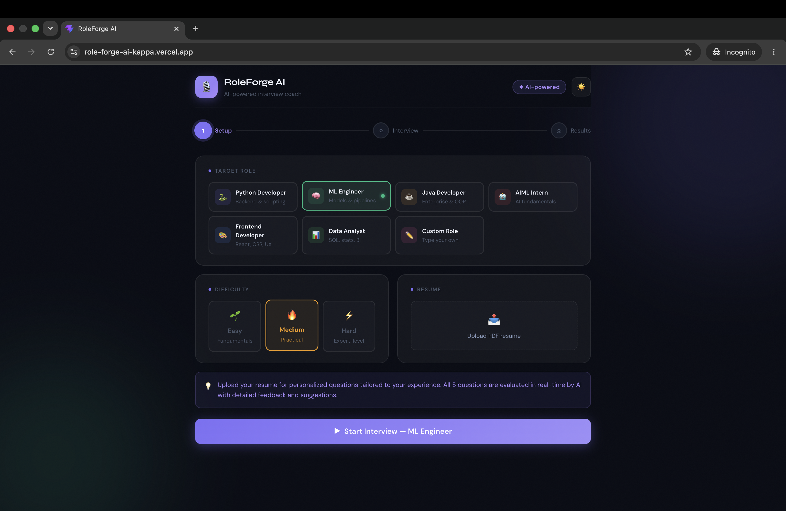
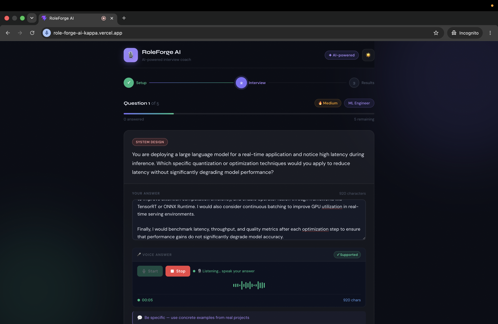
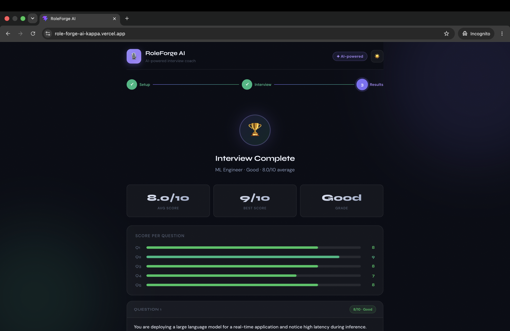
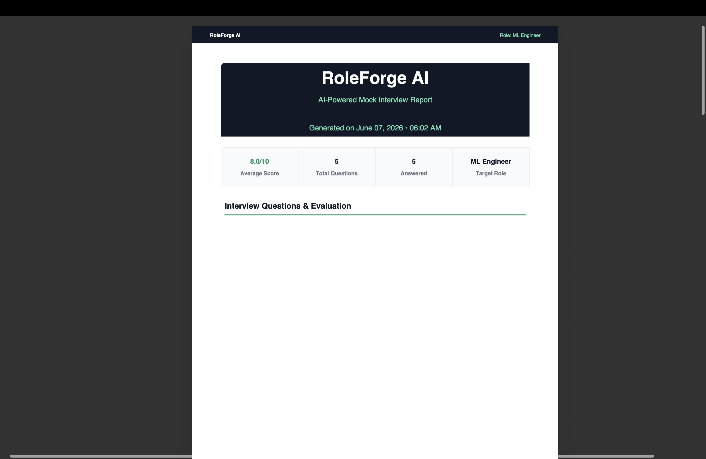

# RoleForge AI 🚀

AI-powered mock interview platform that helps candidates prepare for technical interviews through role-specific questions, resume-based personalization, voice responses, real-time AI evaluation, and downloadable PDF reports.

🌐 **Live Demo:** https://role-forge-ai-kappa.vercel.app

📂 **GitHub Repository:** https://github.com/tarunverma116/RoleForgeAI

---

## 📌 Overview

RoleForge AI simulates real-world technical interviews using Large Language Models (LLMs). Users can select a target role, upload their resume, answer interview questions through text or voice, receive AI-generated feedback, and download a professional interview performance report.

The platform is designed to help students and job seekers identify weaknesses, improve communication skills, and prepare effectively for technical interviews.

---

## ✨ Key Features

* AI-generated role-specific interview questions
* Resume PDF upload and parsing
* Resume-aware interview generation
* Voice answer support
* Real-time AI answer evaluation
* Detailed feedback and improvement suggestions
* Multi-round interview workflow
* Batch question generation for reduced API usage
* Automatic fallback question engine
* Downloadable PDF interview reports
* Mobile responsive design
* Modern and intuitive user interface

---

## 📸 Screenshots

### Setup Screen


### Interview Screen


### Evaluation & Feedback


### Results Dashboard


### PDF Report

---

## 🏗 Architecture

Frontend (React + Vite)
↓
FastAPI Backend
↓
OpenRouter API
↓
Gemma 4 31B LLM
↓
Interview Evaluation
↓
PDF Report Generation

---

## 🛠 Tech Stack

### Frontend

* React.js
* JavaScript
* CSS

### Backend

* FastAPI
* Python

### AI & LLMs

* OpenRouter API
* Google Gemma 4 31B

### PDF Generation

* ReportLab

### Deployment

* Vercel

---

## 🚀 Workflow

1. Select your target role
2. Upload your resume (optional)
3. Generate AI interview questions
4. Answer using text or voice
5. Receive AI-generated evaluation
6. Review detailed feedback and suggestions
7. Download a professional PDF report

---

## 🎯 Supported Roles

* Python Developer
* Java Developer
* Frontend Developer
* Backend Developer
* Machine Learning Engineer
* Data Analyst
* AIML Intern
* Custom Roles

---

## 💡 Challenges Solved

### Resume Personalization

Implemented PDF resume parsing to generate interview questions tailored to a candidate's background and skills.

### AI-Based Evaluation

Integrated LLM-powered answer evaluation to provide scores, feedback, and improvement suggestions in real time.

### API Optimization

Reduced OpenRouter usage significantly by generating multiple interview questions in a single request instead of making repeated API calls.

### Reliability Through Fallback Logic

Built a fallback interview engine that allows interview generation even when AI services are unavailable or rate limits are reached.

### Automated Reporting

Developed dynamic PDF reports containing interview scores, feedback, suggestions, and overall performance summaries.

---

## 📊 Project Highlights

* Full-stack AI application
* Resume-aware interview generation
* Voice-enabled answer submission
* AI-powered evaluation pipeline
* Automated PDF reporting
* Fallback interview engine
* Production deployment
* Mobile responsive design

---

## 📦 Installation

### Backend

```bash
cd backend
pip install -r requirements.txt
uvicorn main:app --reload
```

### Frontend

```bash
cd frontend
npm install
npm run dev
```

---

## 🔮 Future Enhancements

* User Authentication
* Interview History Dashboard
* Performance Analytics
* Company-Specific Interview Modes
* Personalized Learning Recommendations
* Shareable Interview Reports
* Multi-Language Support

---
🌐 Live Demo: https://role-forge-ai-kappa.vercel.app

📂 GitHub Repository: https://github.com/tarunverma116/RoleForgeAI

## 👨‍💻 Author

**Tarun Verma**

Built as a full-stack AI project using React, FastAPI, OpenRouter, and modern deployment platforms.

If you found this project interesting, feel free to star the repository and connect with me on LinkedIn.
